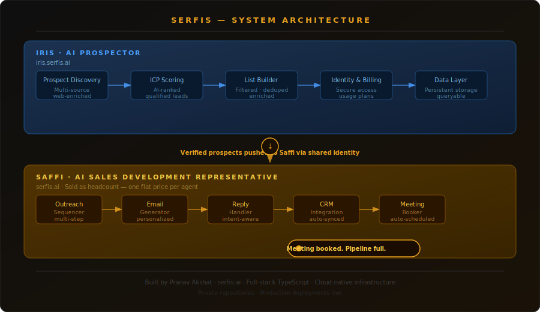

# Serfis

### The AI Workforce

**AI agents that replace headcount — not just automate tasks.**

---

## The Vision

Most AI tools assist humans. Serfis replaces roles.

The thesis: every B2B company has a layer of operational employees — BDRs, researchers, analysts — who spend most of their time on repeatable, information-dense work. That work is exactly what large language models do best. So instead of building software that helps a human do that job, Serfis builds agents that hold that job.

**Humans own strategy. AI owns operations.**

Serfis is sold as headcount, not software. One flat monthly price per agent — no seat fees, no usage tiers, no feature gates. You hire a Serfis agent the same way you'd hire a person.

---

## Products

### Saffi — AI Sales Development Representative

> **Live at [serfis.ai](https://serfis.ai)**

Saffi is a fully autonomous outbound sales agent. One Saffi instance replaces a junior BDR.

Given a target ICP, Saffi:

1. Pulls and scores prospects against your criteria
2. Drafts cold emails trained on your company's voice
3. Runs multi-step follow-up sequences automatically
4. Classifies replies — interested, not now, or unsubscribe
5. Handles follow-up responses autonomously
6. Syncs every interaction to your CRM
7. Books meetings directly to your calendar

No human in the loop until the meeting is confirmed.

**Pricing:** Flat monthly fee per agent — like a salary, not a subscription.

**Target buyer:** Any B2B company currently paying a human to send cold emails — SaaS, consulting, agencies, staffing, professional services.

---

### Iris — AI Prospector

> **Live at [iris.serfis.ai](https://iris.serfis.ai)**

Iris is a research and prospecting agent. It finds, enriches, and scores leads from multiple data sources so your pipeline is always full.

Key capabilities:
- Multi-source prospect discovery
- ICP-based scoring and filtering
- List management with dedup and enrichment
- One-click export to Saffi for outreach

Iris feeds Saffi. Together they form a complete autonomous outbound pipeline — from blank slate to booked meeting — without a human BDR involved.

---

## Architecture

  

The two products share a common identity layer so a user's account works seamlessly across both. Iris verifies prospects and pushes them to Saffi via a shared authentication token — no API keys, no manual export steps.

Each product runs its own independent API and database, keeping concerns separated and allowing each agent to scale independently.

---

## Technical Scope

This is a **private codebase**. The repositories are not public. What I can share:

- **Full-stack TypeScript** — end to end, frontend through backend
- **Two production applications** — separate web apps, separate APIs, shared auth layer
- **AI-powered core** — email generation, lead scoring, reply classification, and research all run on large language models
- **Real payments** — Stripe integration with multiple plans, trial management, and per-instance billing
- **OAuth integrations** — Gmail and Outlook connected via OAuth for sending emails as the user
- **Cloud-native deployment** — edge-hosted frontends, serverless APIs, managed Postgres, global CDN
- **14 database migrations** — schema has evolved with the product through production use

Both products are live, deployed, and accepting real users.

---

## About

Built by **Pranav Akshat** — founder, lead engineer, and product designer.

I designed the product thesis, built both products from scratch (including the infrastructure, auth, payments, AI integrations, and UX), and deployed them to production. This is a solo effort.

I'm building Serfis because I believe the next wave of value creation won't come from better software tools — it'll come from AI that holds actual roles inside companies. The BDR is the first role to go. There are many more after that.

---

**[serfis.ai](https://serfis.ai)** · **[iris.serfis.ai](https://iris.serfis.ai)**

*Serfis is actively developed. The products shown here are live in production.*

